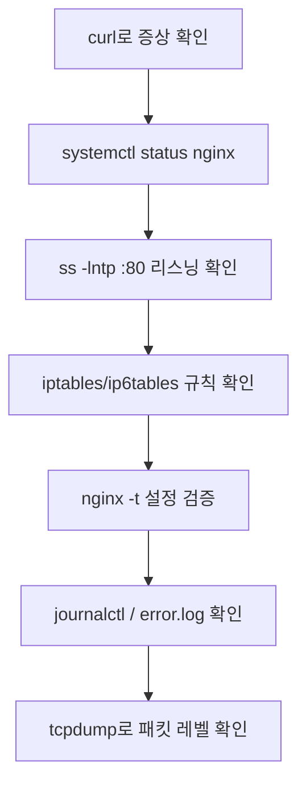
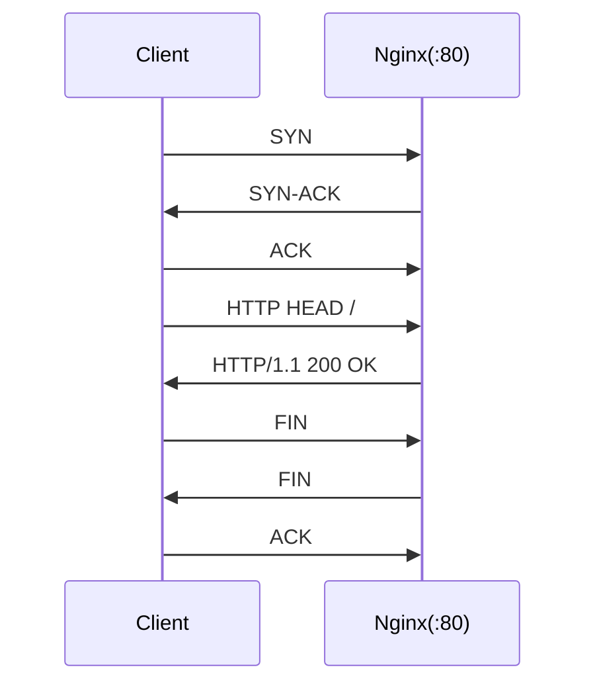

# Nginx 접속 불가 트러블슈팅 런북 (WSL2 Ubuntu)


- WSL2(Ubuntu) 환경에서 Nginx를 설치/기동한 뒤,
- 의도적으로 장애를 재현하고(서비스 중지, 방화벽 차단, 설정 오류),
- 증거 수집 → 원인 분석 → 복구까지 수행한 트러블슈팅 런북입니다.

---

## Troubleshooting Flow



---

## 목표(산출물)
- Nginx 정상 접속 확인
- 장애 3종 재현 및 원인별 증거 수집
- 복구 및 재발 방지 포인트 정리
- tcpdump로 패킷 레벨 정상 동작 검증

---

## 환경
- OS: Ubuntu (WSL2)
- Nginx: `nginx/1.24.0 (Ubuntu)`
- 테스트 대상: `http://localhost:80`

> 참고: WSL2에서는 `localhost`가 IPv6(::1)로 우선 해석될 수 있어,
> IPv4/IPv6에 따라 차단 규칙 적용 여부가 달라질 수 있습니다.

---

## Command Cheat Sheet

| 목적 | 명령 |
|---|---|
| 서비스 상태 | `systemctl status nginx --no-pager` |
| 포트 리스닝 확인 | `sudo ss -lntp \| grep ':80'` |
| 요청 테스트 | `curl -I http://localhost` |
| IPv4 강제 요청 | `curl -4 -I http://localhost` |
| IPv6 강제 요청 | `curl -6 -I http://localhost` |
| 설정 검증 | `sudo nginx -t` |
| 시스템 로그 | `sudo journalctl -u nginx -n 50 --no-pager` |
| nginx 에러 로그 | `sudo tail -n 50 /var/log/nginx/error.log` |
| 방화벽 룰 확인 | `sudo iptables -L INPUT -n --line-numbers`<br>`sudo ip6tables -L INPUT -n --line-numbers` |
| 패킷 캡처 | `sudo tcpdump -i any tcp port 80 -n` |

---

## 1. 설치 및 정상 동작 확인

### 1) 설치/기동
```bash
sudo apt update && sudo apt -y upgrade
sudo apt -y install nginx
sudo systemctl enable --now nginx
```

### 2) 상태/리스닝/응답 확인
```bash
systemctl status nginx --no-pager
sudo ss -lntp | grep ':80'
curl -I http://localhost
```

---

## 2. 공통 진단 커맨드
```bash
# 1) 서비스 상태
systemctl status nginx --no-pager

# 2) 포트 리스닝 확인
sudo ss -lntp | grep ':80' || echo "No listener on 80"

# 3) 요청 테스트
curl -I http://localhost || true

# 4) 에러 로그 확인
sudo tail -n 50 /var/log/nginx/error.log
```

---

## 3. CASE A - Nginx 서비스 중지
**재현**
```bash
sudo systemctl stop nginx
```

**관찰(증거)**
```bash
systemctl status nginx → inactive/dead
ss -lntp | grep :80 → 리스닝 없음
curl -I http://localhost → connection refused
```
<details> <summary>Evidence</summary>


</details>

**원인**
- nginx 프로세스 미기동으로 80 포트 리스닝이 존재하지 않음

**복구**
```bash
sudo systemctl start nginx
curl -I http://localhost
```

**재발 방지/점검 포인트**
- 부팅 시 자동 기동 확인: systemctl is-enabled nginx
- 장애 시 기본 루틴: status → ss → logs

---

## 4. Case B — 방화벽 규칙으로 80 포트 차단 (IPv4/IPv6 차이 포함)
**재현(IPv4 차단)**
```bash
sudo systemctl start nginx
sudo iptables -I INPUT -p tcp --dport 80 -j REJECT
```

**관찰(증거)**
```bash
sudo ss -lntp | grep ':80'          # nginx는 LISTEN 유지
curl -4 -I http://localhost || true # IPv4로 강제 접속 시 실패
curl -6 -I http://localhost || true # IPv6로 강제 접속 시 성공할 수 있음
```

**원인**
- iptables는 IPv4 규칙이므로, localhost가 IPv6(::1)로 연결되면 우회될 수 있음

**조치(IPv6도 차단)**
```bash
sudo ip6tables -I INPUT -p tcp --dport 80 -j REJECT
curl -6 -I http://localhost || true
```
<details> <summary>Evidence: iptables / ip6tables rules</summary>


</details>

**복구(규칙 제거)**
- 보통 -I로 넣으면 1번 라인에 들어가므로, 라인번호 확인 후 삭제합니다.
```bash
sudo iptables  -D INPUT 1
sudo ip6tables -D INPUT 1
curl -4 -I http://localhost
curl -6 -I http://localhost
```

**재발 방지/점검 포인트**
- 방화벽 룰 변경 이력/승인 프로세스
- 배포 후 헬스체크 자동화(예: curl -f http://localhost/)

---

## 5. Case C — 설정 오류로 기동/재시작 실패 유도 (nginx -t 선검증)

**재현(설정 백업 후 오류 삽입)**
```bash
sudo cp /etc/nginx/nginx.conf /etc/nginx/nginx.conf.bak
sudo sh -c 'printf "\nTHIS_IS_ERROR;\n" >> /etc/nginx/nginx.conf'
```
**설정 테스트(핵심)**
```bash
sudo nginx -t
# 기대: unknown directive 또는 구문 오류로 test failed
```

**재시작 실패 증거 수집**
```bash
sudo systemctl restart nginx || true
systemctl status nginx -l --no-pager
sudo journalctl -u nginx -n 50 --no-pager
sudo tail -n 50 /var/log/nginx/error.log
```

**원인**
- 설정 파일 구문 오류로 인해 nginx가 기동/재시작 불가

**복구(롤백)**
```bash
sudo mv /etc/nginx/nginx.conf.bak /etc/nginx/nginx.conf
sudo nginx -t
sudo systemctl restart nginx
curl -I http://localhost
```
<details> <summary>Evidence: nginx -t / systemd logs</summary>

</details>

**재발 방지/점검 포인트**
- 배포 파이프라인/운영 절차에 nginx -t 사전 검증 포함
- 설정 변경은 PR/리뷰 기반으로 관리

---

## 6. tcpdump로 패킷 레벨 검증(정상 흐름)

**캡처 실행**
```bash
sudo tcpdump -i any tcp port 80 -n
```

**요청 생성(예: Windows에서)**
- PowerShell에서는 curl이 Invoke-WebRequest 별칭일 수 있으므로 curl.exe 사용
```powershell
curl.exe -I http://localhost
```

**패킷 흐름 요약**


**해석 포인트(정상 시)**
- SYN → SYN-ACK → ACK (3-way handshake)
- HTTP HEAD 요청
- HTTP/1.1 200 OK 응답
- FIN 교환으로 정상 종료

**배운 점**
- “접속 불가”는 서비스 상태/리스닝/방화벽/설정 오류 등 원인 영역이 다르므로, 증거 기반으로 빠르게 범위를 좁히는 루틴이 중요함.
- WSL2 환경에서는 localhost가 IPv6로 해석될 수 있어, iptables(IPv4)만으로는 차단이 완성되지 않을 수 있음.
- 설정 변경 시 nginx -t 선검증은 필수.
